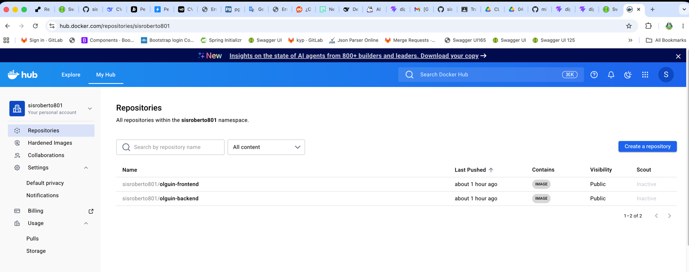
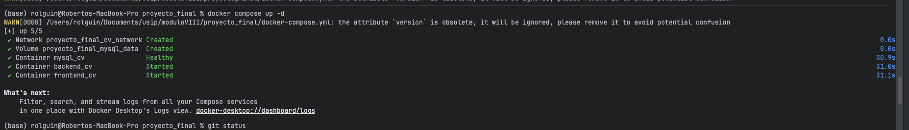
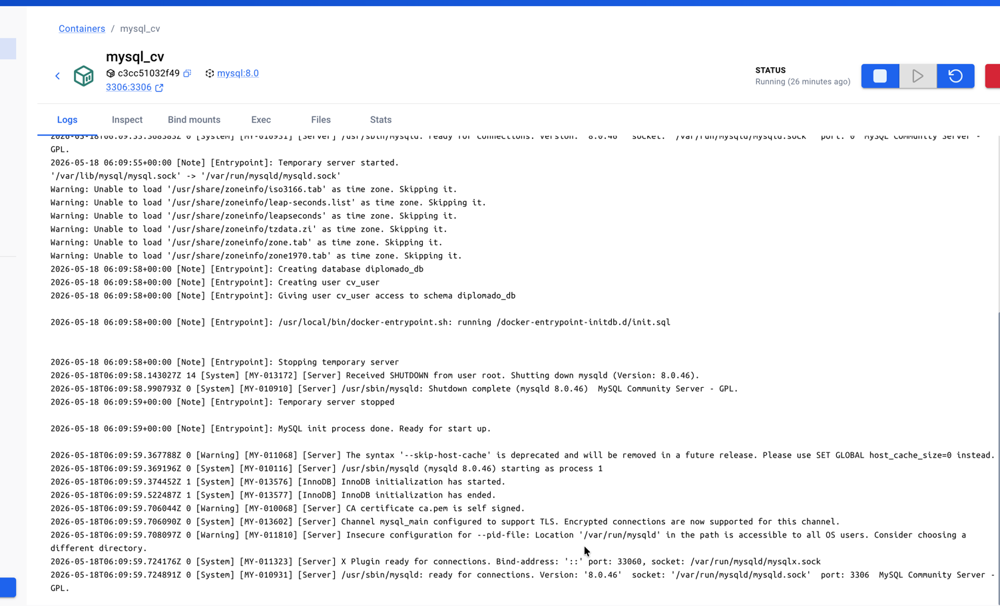
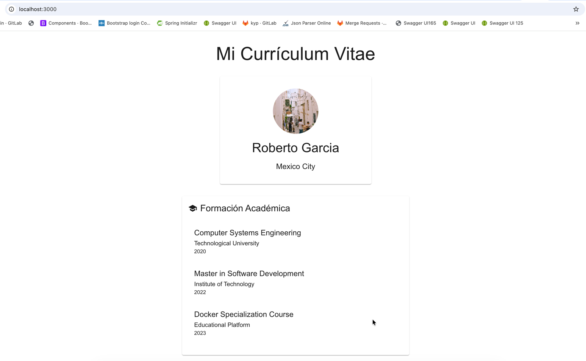
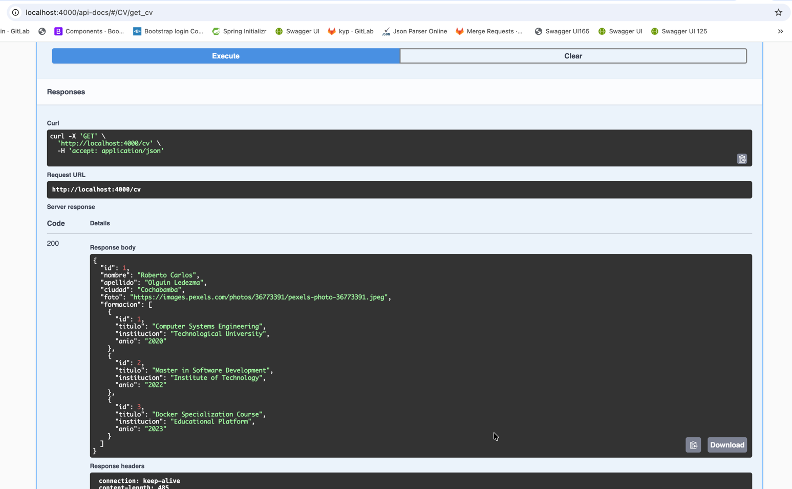

# Práctica Final - CV Personal con Docker Compose

## Estudiante
- **Nombre**: Roberto Carlos Olguin Ledezma
- **Fecha:** Mayo 2026

## 1. URL del Repositorio GitHub
```
https://github.com/sisroberto801/proyecto_final.git
```

## 2. Nombres de Imágenes Publicadas en Docker Hub
- **Frontend**: sisroberto801/olguin-frontend:v1
- **Backend**: sisroberto801/olguin-backend:v1



## 3. Arquitectura del Proyecto

### Servicios Configurados
| Servicio | Tecnología | Puerto | Versión |
|----------|------------|--------|---------|
| frontend | React + Nginx | 3000 | nginx:1.27-alpine |
| backend | Node.js | 4000 | node:20-alpine |
| database | MySQL | 3306 | mysql:8.0 |

### Red Docker
- **Nombre**: cv_network
- **Driver**: bridge
- **Todos los servicios conectados a la misma red**

### Volúmenes
- **mysql_data**: Para persistencia de datos MySQL

## 4. Estructura de Base de Datos

### Tabla: persona
| Campo | Tipo | Descripción |
|-------|------|-------------|
| id | INT | Primary Key, Auto Increment |
| nombre | VARCHAR(255) | Nombre del estudiante |
| apellido | VARCHAR(255) | Apellido del estudiante |
| ciudad | VARCHAR(255) | Ciudad de residencia |
| foto | VARCHAR(255) | URL de la fotografía |

### Tabla: formacion
| Campo | Tipo | Descripción |
|-------|------|-------------|
| id | INT | Primary Key, Auto Increment |
| titulo | VARCHAR(255) | Título del estudio |
| institucion | VARCHAR(255) | Nombre de la institución |
| anio | VARCHAR(50) | Año de finalización |
| persona_id | INT | Foreign Key a persona.id |

## 5. Datos del Estudiante

### Información Personal
- **Nombre Completo**: Roberto Carlos Olguin Ledezma
- **Ciudad**: Cochabamba
- **Fotografía**: https://images.pexels.com/photos/36773391/pexels-photo-36773391.jpeg

### Formación Académica
1. **Computer Systems Engineering** - Technological University (2020)
2. **Master in Software Development** - Institute of Technology (2022)
3. **Docker Specialization Course** - Educational Platform (2023)

## 6. Capturas de Evidencia Requeridas

### 6.1 Construcción de Imágenes
```bash
# Backend
docker build -t sisroberto801/olguin-backend:v1 ./backend

# Frontend  
docker build -t sisroberto801/olguin-frontend:v1 ./frontend
```

### 6.2 Publicación en Docker Hub
```bash
# Backend
docker push sisroberto801/olguin-backend:v1

# Frontend
docker push sisroberto801/olguin-frontend:v1
```

### 6.3 Ejecución de Docker Compose
```bash
docker compose up -d
```


### 6.4 Creación Automática de Base de Datos
- Script SQL: `/database/init.sql`
- Ubicación en contenedor: `/docker-entrypoint-initdb.d/init.sql`
- Ejecución automática al iniciar MySQL

### 6.5 Funcionamiento de la Aplicación
- **URL**: http://localhost:3000
- **Endpoint Backend**: http://localhost:4000/cv
- **Base de Datos**: diplomado_db

## 7. Instrucciones de Ejecución

### 7.1 Requisitos Previos
- Docker instalado
- Docker Compose instalado
- Acceso a Docker Hub

### 7.2 Pasos de Ejecución

#### Paso 1: Clonar el Repositorio
```bash
git clone https://github.com/sisroberto801/proyecto_final.git
cd proyecto_final
```

#### Paso 2: Configurar Variables de Entorno
El archivo `.env` ya contiene la configuración necesaria:
```
PORT=4000
DB_HOST=database
DB_USER=cv_user
DB_PASSWORD=12345
DB_DATABASE=diplomado_db
DB_DIALECT=mysql
DB_USE_SSL=false
```


#### Paso 3: Iniciar la Aplicación
```bash
docker compose up -d
```

#### Paso 4: Verificar Funcionamiento
- **Frontend**: http://localhost:3000
- 
- **Backend API**: http://localhost:4000/cv
- 
- **Base de Datos**: localhost:3306

#### Paso 5: Detener la Aplicación
```bash
docker compose down
```

## 8. Comando Principal de Inicio

```bash
docker compose up -d
```

Este comando único:
1. Descarga las imágenes desde Docker Hub
2. Inicia el contenedor MySQL
3. Crea automáticamente la base de datos y tablas
4. Inserta los registros iniciales
5. Inicia el backend Node.js
6. Inicia el frontend React con Nginx
7. Expone la aplicación en http://localhost:3000

## 9. Flujo de Funcionamiento Automático

1. **Docker Compose** descarga imágenes desde Docker Hub
2. **MySQL** se inicia y ejecuta script SQL automáticamente
3. **Base de datos** se crea con tablas y datos iniciales
4. **Backend** se conecta a MySQL y expone endpoint GET /cv
5. **Frontend** consume datos del backend y muestra el CV
6. **Navegador** muestra información completa del estudiante

## 10. Criterios de Calificación Cumplidos

### ✅ Funcionamiento Integral (25%)
- Aplicación inicia con un solo comando
- Muestra información desde base de datos MySQL
- Frontend consume datos del backend correctamente

### ✅ Base de Datos (25%)
- Creación automática de tablas mediante scripts SQL
- Inserción automática de registros
- Estructura correcta de tablas persona y formacion

### ✅ Docker Compose (25%)
- Configuración correcta de servicios, red, puertos y volumen
- Dependencias correctamente definidas
- Red Docker única cv_network

### ✅ Documento de Entrega (25%)
- URL del repositorio GitHub incluida
- Nombres de imágenes publicadas especificados
- Instrucciones de ejecución detalladas
- Comando principal de inicio proporcionado

## 11. Tecnologías Utilizadas

### Frontend
- **React**: Framework de JavaScript
- **TypeScript**: Tipado estático
- **Material-UI**: Biblioteca de componentes
- **Nginx**: Servidor web para producción

### Backend
- **Node.js**: Runtime JavaScript
- **Express**: Framework web
- **Sequelize**: ORM para MySQL
- **MySQL**: Base de datos relacional

### DevOps
- **Docker**: Contenerización
- **Docker Compose**: Orquestación
- **Docker Hub**: Registro de imágenes
- **GitHub**: Control de versiones

---

**Fecha de Entrega**: 18 de mayo de 2026  
**Proyecto**: CV Personal con Docker Compose  
**Estudiante**: Roberto Carlos Olguin Ledezma
